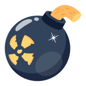

## Описание
<p>Прототип игры в жанре “головоломка с механикой Blast”. Поиграть можно <a href="https://tapclap-blastgame-vetrash.vercel.app/">тут</a> или <a href="https://tapclap-blastgame-git-main-vetrash.vercel.app/">тут</a>.</p>


<p>Игра состоит из игрового поля размера 8*8. В каждой ячейке поля находится игровой объект (далее именуемый тайл) определенного цвета. Количество возможных вариантов цветов равно 5. </p>
<p>Начальное состояние поля задается случайно (вероятность цвета тайла является равновероятной). При клике на тайл сжигается (удаляется) область, состоящая из группы прилегающих тайлов того же цвета, размер группы не может быть меньше, чем 2 шт. На месте удаленных образуются пустые места. </p>
<p>Далее происходит перемещение тайлов на пустые места сверху вниз. Если верхняя ячейка становится пустой, создаются новые тайлы и поле укомплектовывается. </p>
<p>На заполненном поле всегда можно сжечь тайлы. Если такой возможности нет и нет монет на способности, игра перемешивает тайлы на поле. Если же после двух перемешиваний подряд нет возможности сжечь тайлы, то такая ситуация является проигрышем для игрока. </p>
<p>Цель игры – набрать 30000 очков за 21 ход, иначе проигрыш. За каждую набранную 1000 очков игроку присваивается 1 монета. </p>
<p>Начисленные очки зависят от длинны составленной цепочки, также игра хвалит стикерами при цепочке более 3 фигур. Если при уничтожении размер группы тайлов больше, чем 7, то тогда на месте клетки, по которой был клик, появится способность. </p>

## Установка
```sh
npm run i
```
## Запуск локального сервера
```sh
npm run serve
```
## Активные способности
Для активации способности необходимо выбрать в баре способностей. Активная способность обрамляется золотой рамкой. Для отказа от способности нажмите еще раз на способность рамка должна исчезнуть.
| Иконка | Описание |
| ------------- | ------------- |
|   | Бомба уничтажает все блоки квадратом 3х3 фигуры (центр квадрата является фигура активации). Выберите центр взрыва на игровом поле  |
|   |Телепорт позволяет поменять дви фигуры на поле местами. По очереди выберети фигуры на доске. После выбора второй фигуры поменяются. |
|  | Молнии уничтожают 6 случайных фигур на поле, активация мгновенная. после выбора. |


## Способности на игровом поле
Для активации способности нажмите на фигуру на игровой доске (ход списываться не будет)
| Иконка | Описание |
| ------------- | ------------- |
|    | Уничтожает все поле. Очков начисляется не по стандартной формуле. |
|    | Уничтожает строку в которой активировано. |
|    | Уничтожает столбец в котором активировано. |

## Настройки

<p>В файле <a href="src/settings.js"> настроек</a> можно задать большинство переменных. Для простоты оставил комментарии для каждой переменной. Таким образом возможно настроить игру под свои нужды. В дальнейшем планируются добавить звуки и анимации, а также конструктор сложных игровых полей с нестандартной формой. </p>


